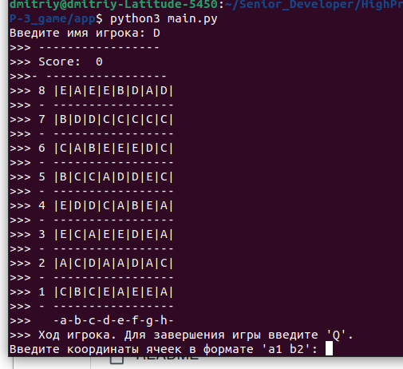
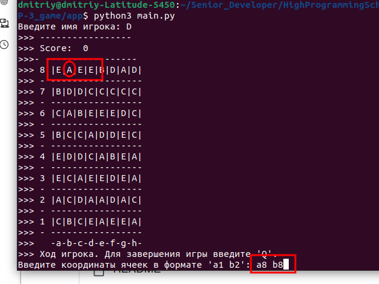
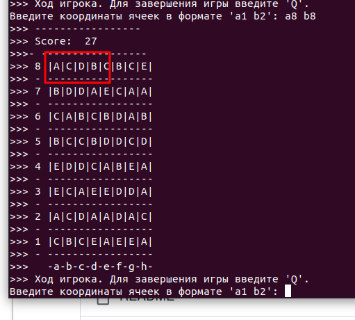

Цель игры - переставить ячейки таким образом, чтоб получилась комбинация из трех и более одинаковых элементов в ряд (вертикальный или горизонтальный), либо крест из 5 элементов.

В корневой папке проекта выполните команду

```python3 main.py```

Введите имя игрока.



Вводите ход в формате `первая ячейка a1` `вторая ячейка a2` которые надо поменять.



Если комбинации будут найдены, то они исчезнут, на их место сгенерируются новые значения, обновится счет.



Для выхода введите `Q`